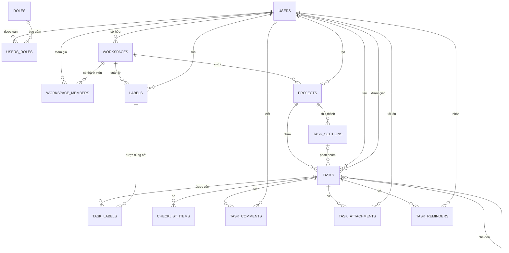

# Tổng quan database của Smart Scheduler

## 1. Phạm vi tài liệu

Tài liệu này được tổng hợp từ toàn bộ source code trong:

```text
src/main/java/com/dww/chat_app/entity
```

Nguồn phân tích gồm 13 class có `@Entity`, 8 enum và các annotation JPA như `@Table`, `@JoinColumn`, `@ManyToOne`, `@ManyToMany`, `@UniqueConstraint`, `@Index`.

Theo mapping hiện tại, mô hình có:

- **13 bảng entity chính**: mỗi bảng tương ứng trực tiếp với một class `@Entity`.
- **2 bảng nối many-to-many**: `users_roles` và `task_labels`.
- **Tổng cộng dự kiến: 15 bảng**.

> Lưu ý: `spring.jpa.hibernate.ddl-auto` đang là `update`. Danh sách dưới đây phản ánh mapping hiện tại trong source code. Database đang chạy có thể còn bảng/cột cũ do Hibernate `update` thường không tự xóa cấu trúc không còn được dùng. Muốn xác nhận database vật lý tuyệt đối, cần chạy thêm `SHOW TABLES` hoặc truy vấn tương đương trên database.

## 2. Danh sách nhanh các bảng

| STT | Bảng | Loại | Mục đích chính |
|---:|---|---|---|
| 1 | `users` | Entity | Tài khoản đăng nhập và trạng thái người dùng |
| 2 | `roles` | Entity | Danh mục quyền hệ thống toàn cục |
| 3 | `users_roles` | Bảng nối | Gán nhiều role hệ thống cho nhiều user |
| 4 | `invalidated_token` | Entity | Danh sách JWT đã bị vô hiệu hóa khi logout |
| 5 | `workspaces` | Entity | Không gian làm việc cá nhân hoặc nhóm |
| 6 | `workspace_members` | Entity liên kết | Thành viên và vai trò của user trong từng workspace |
| 7 | `projects` | Entity | Dự án/danh sách công việc thuộc workspace |
| 8 | `task_sections` | Entity | Chia project thành các section/cột/nhóm công việc |
| 9 | `labels` | Entity | Nhãn dùng chung trong một workspace |
| 10 | `tasks` | Entity trung tâm | Công việc, lịch, trạng thái, người phụ trách và lặp lịch |
| 11 | `task_labels` | Bảng nối | Gắn nhiều label cho nhiều task |
| 12 | `checklist_items` | Entity | Các mục checklist nhỏ bên trong task |
| 13 | `task_comments` | Entity | Bình luận/thảo luận trên task |
| 14 | `task_attachments` | Entity | Metadata file đính kèm của task |
| 15 | `task_reminders` | Entity | Lịch nhắc việc và trạng thái gửi nhắc |

## 3. Sơ đồ quan hệ tổng quát



Luồng dữ liệu chính có thể đọc ngắn gọn như sau:

```text
User
 └── Workspace
      ├── WorkspaceMember ── User
      ├── Label
      └── Project
           ├── TaskSection
           └── Task
                ├── Task con
                ├── Label (qua task_labels)
                ├── ChecklistItem
                ├── TaskComment
                ├── TaskAttachment
                └── TaskReminder
```

## 4. Cụm tài khoản và phân quyền hệ thống

### 4.1. `users`

**Entity:** `User.java`

Đây là bảng gốc của người dùng, chịu trách nhiệm lưu thông tin đăng nhập và trạng thái tài khoản.

Các trường đáng chú ý:

| Trường | Ý nghĩa |
|---|---|
| `id` | Khóa chính UUID |
| `username` | Tên đăng nhập, bắt buộc và duy nhất |
| `email` | Email, duy nhất nhưng có thể để trống |
| `password` | Mật khẩu đã mã hóa/hash do ứng dụng lưu |
| `active` | Tài khoản có đang hoạt động hay không |
| `deleted_at` | Thời điểm soft-delete tài khoản |
| `created_at`, `updated_at` | Thời điểm tạo và cập nhật tự động |

Quan hệ:

- Nhiều user có thể có nhiều role thông qua `users_roles`.
- Một user có thể sở hữu nhiều workspace qua `workspaces.owner_id`.
- Một user có thể tham gia nhiều workspace qua `workspace_members`.
- User còn xuất hiện với các vai trò nghiệp vụ khác: người tạo project/label/task, người được giao task, tác giả comment, người tải file và người nhận reminder.

### 4.2. `roles`

**Entity:** `Role.java`

Lưu danh mục quyền ở cấp **toàn hệ thống**, ví dụ có thể là `ADMIN`, `USER` hoặc các role khác do ứng dụng quy định.

| Trường | Ý nghĩa |
|---|---|
| `name` | Khóa chính của role; đồng thời unique |
| `description` | Mô tả quyền |

Role trong bảng này khác với role ở `workspace_members`:

- `roles`: quyền toàn hệ thống, liên quan xác thực/authorization chung.
- `workspace_members.role`: quyền chỉ trong một workspace cụ thể.

### 4.3. `users_roles`

**Nguồn:** quan hệ `User.roles` với `@ManyToMany`.

Đây là bảng nối giữa `users` và `roles`.

| Cột nối | Tham chiếu |
|---|---|
| `user_id` | `users.id` |
| `role_name` | `roles.name` |

Ví dụ: user A có cả `USER` và `ADMIN` thì bảng này có hai dòng cho cùng `user_id`.

Tên `users_roles` là tên Hibernate/JPA dự kiến sinh ra vì `@JoinTable` không khai báo thuộc tính `name`. Hai tên cột nối đã được khai báo rõ trong code.

### 4.4. `invalidated_token`

**Entity:** `InvalidatedToken.java`

Lưu các JWT đã bị vô hiệu hóa, thường dùng cho quy trình logout. Khi nhận JWT, ứng dụng có thể kiểm tra JWT ID có nằm trong bảng này hay không; nếu có thì từ chối token dù token chưa hết hạn.

| Trường | Ý nghĩa |
|---|---|
| `jwtId` | JWT ID, khóa chính UUID |
| `logout_time` | Thời điểm token bị vô hiệu hóa |

Bảng này hiện không có khóa ngoại tới `users`; nó độc lập với phần còn lại của mô hình.

## 5. Cụm workspace và thành viên

### 5.1. `workspaces`

**Entity:** `Workspace.java`

Workspace là vùng chứa cấp cao nhất cho dữ liệu lập kế hoạch. Một workspace có thể là không gian cá nhân hoặc không gian của nhóm.

| Trường | Ý nghĩa |
|---|---|
| `id` | Khóa chính UUID |
| `owner_id` | User sở hữu workspace, bắt buộc |
| `name`, `description` | Tên và mô tả workspace |
| `type` | `PERSONAL` hoặc `TEAM`; mặc định `PERSONAL` |
| `color` | Màu dùng để hiển thị |
| `archived_at` | Thời điểm lưu trữ/ẩn workspace |
| `deleted_at` | Thời điểm soft-delete workspace |
| `created_at`, `updated_at` | Audit thời gian |
| `version` | Optimistic locking, tránh ghi đè cập nhật đồng thời |

Quan hệ:

- `owner_id -> users.id`: nhiều workspace có thể thuộc cùng một user.
- Một workspace có nhiều dòng `workspace_members`.
- Một workspace có nhiều `projects`.
- Một workspace có nhiều `labels`.

### 5.2. `workspace_members`

**Entity:** `WorkspaceMember.java`

Đây không chỉ là bảng nối đơn giản. Nó là một entity riêng vì ngoài hai khóa ngoại, nó còn lưu role, thời điểm tham gia, cập nhật và version.

| Trường | Ý nghĩa |
|---|---|
| `id` | Khóa chính UUID |
| `workspace_id` | Workspace mà user tham gia |
| `user_id` | User tham gia workspace |
| `role` | `OWNER`, `ADMIN`, `MEMBER`, `VIEWER`; mặc định `MEMBER` |
| `joined_at` | Thời điểm tham gia |
| `updated_at` | Thời điểm membership được cập nhật |
| `version` | Optimistic locking |

Ràng buộc unique `(workspace_id, user_id)` bảo đảm một user chỉ có một membership trong cùng một workspace.

Mối quan hệ này có thể hiểu là:

```text
users 1 ── N workspace_members N ── 1 workspaces
```

`workspaces.owner_id` biểu thị chủ sở hữu trực tiếp, còn `workspace_members.role = OWNER` biểu thị vai trò thành viên. Source hiện không có ràng buộc database bắt buộc hai thông tin này luôn đồng bộ; service nên bảo đảm owner cũng có membership phù hợp.

## 6. Cụm project, section và label

### 6.1. `projects`

**Entity:** `Project.java`

Project là vùng tổ chức task bên trong một workspace. Nó có thể hiển thị dạng danh sách, bảng Kanban hoặc lịch.

| Trường | Ý nghĩa |
|---|---|
| `id` | Khóa chính UUID |
| `workspace_id` | Workspace chứa project |
| `created_by_id` | User tạo project |
| `name`, `description` | Nội dung mô tả project |
| `color`, `icon` | Thông tin giao diện |
| `view_type` | `LIST`, `BOARD`, `CALENDAR`; mặc định `LIST` |
| `sort_order` | Thứ tự project trong workspace |
| `archived_at` | Lưu trữ/ẩn project |
| `deleted_at` | Soft-delete project |
| `created_at`, `updated_at`, `version` | Audit và kiểm soát cập nhật đồng thời |

Quan hệ:

- Nhiều project thuộc một workspace.
- Nhiều project có thể do cùng một user tạo.
- Một project có nhiều section và nhiều task.

### 6.2. `task_sections`

**Entity:** `TaskSection.java`

Section chia một project thành các nhóm nhỏ. Trong chế độ board, section có thể tương đương một cột; trong list, section có thể là một nhóm công việc.

| Trường | Ý nghĩa |
|---|---|
| `id` | Khóa chính UUID |
| `project_id` | Project chứa section |
| `name`, `description` | Tên và mô tả section |
| `sort_order` | Thứ tự section trong project |
| `archived_at` | Thời điểm section được lưu trữ |
| `created_at`, `updated_at`, `version` | Audit và optimistic locking |

Một project có nhiều section; một task có thể thuộc một section hoặc không thuộc section nào.

### 6.3. `labels`

**Entity:** `Label.java`

Label là nhãn phân loại dùng chung trong phạm vi workspace, ví dụ `Backend`, `Khẩn cấp`, `Cá nhân`.

| Trường | Ý nghĩa |
|---|---|
| `id` | Khóa chính UUID |
| `workspace_id` | Workspace sở hữu label |
| `created_by_id` | User tạo label |
| `name` | Tên label |
| `color` | Màu hiển thị |
| `archived_at` | Thời điểm label được lưu trữ |
| `created_at`, `updated_at`, `version` | Audit và optimistic locking |

Ràng buộc unique `(workspace_id, name)` có nghĩa:

- Hai workspace khác nhau có thể cùng có label tên `Urgent`.
- Trong cùng một workspace không thể có hai label trùng tên.

Label liên kết many-to-many với task qua bảng `task_labels`.

## 7. Bảng trung tâm `tasks`

### 7.1. Mục đích

**Entity:** `Task.java`

`tasks` là bảng trung tâm của toàn bộ nghiệp vụ Smart Scheduler. Nó lưu nội dung công việc, vị trí trong project/section, người tạo, người phụ trách, thời gian, trạng thái, mức ưu tiên và quy tắc lặp.

### 7.2. Các nhóm trường chính

| Nhóm | Trường | Ý nghĩa |
|---|---|---|
| Định danh | `id` | Khóa chính UUID |
| Vị trí | `project_id` | Project chứa task, bắt buộc |
| Vị trí | `section_id` | Section chứa task, không bắt buộc |
| Cây task | `parent_task_id` | Task cha, dùng tạo subtask |
| Người dùng | `created_by_id` | User tạo task, bắt buộc |
| Người dùng | `assignee_id` | User được giao task, có thể trống |
| Nội dung | `title`, `description` | Tiêu đề và mô tả |
| Trạng thái | `status` | `TODO`, `IN_PROGRESS`, `COMPLETED`, `CANCELLED` |
| Ưu tiên | `priority` | `NONE`, `LOW`, `MEDIUM`, `HIGH`, `URGENT` |
| Thời gian | `start_at`, `due_at`, `all_day`, `time_zone` | Khoảng thời gian và múi giờ |
| Lặp lịch | `recurrence_rule` | Chuỗi quy tắc lặp, tối đa 1000 ký tự |
| Lặp lịch | `recurrence_mode` | `NONE`, `FIXED_SCHEDULE`, `AFTER_COMPLETION` |
| Hoàn thành | `completed_at` | Thời điểm hoàn thành |
| Vòng đời | `archived_at`, `deleted_at` | Lưu trữ và soft-delete |
| Sắp xếp | `sort_order` | Thứ tự trong section hoặc dưới task cha |
| Audit | `created_at`, `updated_at`, `version` | Audit và optimistic locking |

### 7.3. Quan hệ gần nhất của task

- `project_id -> projects.id`: mỗi task bắt buộc thuộc đúng một project.
- `section_id -> task_sections.id`: task có thể nằm trong một section.
- `parent_task_id -> tasks.id`: quan hệ tự tham chiếu để tạo task cha/subtask.
- `created_by_id -> users.id`: user tạo task.
- `assignee_id -> users.id`: user chịu trách nhiệm chính; mapping hiện tại chỉ hỗ trợ **một assignee trực tiếp cho mỗi task**.
- Many-to-many với `labels` thông qua `task_labels`.
- Một task có thể có nhiều checklist item, comment, attachment và reminder.

### 7.4. Task lặp

`recurrence_mode` cho biết cách lặp:

- `NONE`: không lặp.
- `FIXED_SCHEDULE`: lặp theo một lịch cố định.
- `AFTER_COMPLETION`: kỳ tiếp theo phụ thuộc thời điểm hoàn thành kỳ hiện tại.

Khi tạo entity, nếu có `recurrence_rule` nhưng mode đang rỗng hoặc `NONE`, code tự chuyển mode thành `FIXED_SCHEDULE`.

## 8. Các bảng phụ thuộc trực tiếp vào task

### 8.1. `task_labels`

**Nguồn:** quan hệ `Task.labels` với `@ManyToMany`.

Bảng nối giữa task và label:

| Cột nối | Tham chiếu |
|---|---|
| `task_id` | `tasks.id` |
| `label_id` | `labels.id` |

Một task có thể có nhiều label và một label có thể gắn cho nhiều task.

Ví dụ:

```text
Task "Sửa API đăng nhập"
  ├── Backend
  ├── Bug
  └── Urgent
```

### 8.2. `checklist_items`

**Entity:** `ChecklistItem.java`

Lưu các bước nhỏ cần thực hiện bên trong một task.

| Trường | Ý nghĩa |
|---|---|
| `id` | Khóa chính UUID |
| `task_id` | Task sở hữu checklist item |
| `content` | Nội dung bước nhỏ |
| `completed` | Đã hoàn thành hay chưa; mặc định `false` |
| `completed_at` | Thời điểm hoàn thành |
| `sort_order` | Thứ tự item trong task |
| `created_at`, `updated_at`, `version` | Audit và optimistic locking |

Quan hệ: một task có nhiều checklist item; mỗi item chỉ thuộc một task.

### 8.3. `task_comments`

**Entity:** `TaskComment.java`

Lưu hội thoại, trao đổi hoặc ghi chú của người dùng trên task.

| Trường | Ý nghĩa |
|---|---|
| `id` | Khóa chính UUID |
| `task_id` | Task được bình luận |
| `author_id` | User viết bình luận |
| `content` | Nội dung bình luận dạng text |
| `deleted_at` | Soft-delete bình luận |
| `created_at`, `updated_at`, `version` | Audit và optimistic locking |

Quan hệ:

- Một task có nhiều comment.
- Một user có thể viết nhiều comment.

### 8.4. `task_attachments`

**Entity:** `TaskAttachment.java`

Lưu metadata của file gắn vào task. Bảng không lưu trực tiếp nội dung nhị phân của file; `storage_key` dùng để tìm file trong hệ thống lưu trữ như local disk, S3 hoặc object storage.

| Trường | Ý nghĩa |
|---|---|
| `id` | Khóa chính UUID |
| `task_id` | Task chứa file |
| `uploaded_by_id` | User tải file lên |
| `original_file_name` | Tên file gốc |
| `storage_key` | Khóa/đường dẫn trong storage; unique |
| `content_type` | MIME type, ví dụ `image/png` |
| `size_bytes` | Kích thước file theo byte |
| `deleted_at` | Soft-delete attachment |
| `created_at`, `updated_at`, `version` | Audit và optimistic locking |

Quan hệ:

- Một task có nhiều attachment.
- Một user có thể upload nhiều attachment.

### 8.5. `task_reminders`

**Entity:** `TaskReminder.java`

Lưu lịch nhắc và trạng thái gửi nhắc việc cho một user cụ thể.

| Trường | Ý nghĩa |
|---|---|
| `id` | Khóa chính UUID |
| `task_id` | Task cần nhắc |
| `recipient_id` | User nhận nhắc |
| `remind_at` | Thời điểm phải gửi nhắc |
| `time_zone` | Múi giờ dùng khi tính lịch |
| `channel` | `IN_APP`, `EMAIL`, `PUSH`; mặc định `IN_APP` |
| `status` | `PENDING`, `SENT`, `CANCELLED`, `FAILED`; mặc định `PENDING` |
| `sent_at` | Thời điểm đã gửi thành công |
| `created_at`, `updated_at`, `version` | Audit và optimistic locking |

Quan hệ:

- Một task có thể tạo nhiều reminder.
- Một user có thể nhận reminder từ nhiều task.
- Cùng một task có thể nhắc nhiều người hoặc nhắc một người nhiều lần ở các thời điểm/kênh khác nhau.

Các index `(status, remind_at)` và `(recipient_id, status, remind_at)` hỗ trợ worker tìm nhanh reminder đang chờ đến hạn.

## 9. Giải thích quan hệ theo các tình huống nghiệp vụ

### 9.1. User tạo workspace cá nhân

```text
users
  └── workspaces.owner_id
       └── workspaces.type = PERSONAL
```

User là owner trực tiếp. Ứng dụng nên đồng thời tạo một dòng `workspace_members` có role `OWNER` nếu các API kiểm tra quyền dựa trên membership.

### 9.2. User tham gia workspace nhóm

```text
users.id
   └── workspace_members.user_id
          ├── workspace_members.workspace_id ──> workspaces.id
          └── workspace_members.role = ADMIN/MEMBER/VIEWER
```

Một user có thể có vai trò khác nhau trong các workspace khác nhau.

### 9.3. Tạo project và phân nhóm công việc

```text
workspaces
  └── projects
       ├── task_sections
       └── tasks
```

Project luôn thuộc workspace. Section luôn thuộc project. Task luôn thuộc project nhưng section là tùy chọn, nên vẫn có thể tạo task chưa được phân nhóm.

### 9.4. Giao một task và cộng tác

```text
tasks.assignee_id       ──> users.id
task_comments.author_id ──> users.id
task_attachments.uploaded_by_id ──> users.id
task_reminders.recipient_id ──> users.id
```

Một user có thể được giao task, người khác bình luận, người khác tải file, và reminder có thể được gửi cho một recipient được chỉ định.

### 9.5. Task cha và subtask

```text
tasks.id <── tasks.parent_task_id
```

Đây là quan hệ tự tham chiếu. Một task cha có thể có nhiều task con vì nhiều dòng con cùng trỏ `parent_task_id` về một `tasks.id`.

`checklist_items` khác subtask:

- Checklist item là bước nhỏ, cấu trúc đơn giản, không có assignee/priority/due date riêng.
- Subtask vẫn là một task đầy đủ, có thể có trạng thái, lịch, assignee, label và các dữ liệu phụ riêng.

## 10. Các enum không tạo bảng riêng

8 enum dưới đây được lưu trực tiếp dưới dạng chuỗi trong các cột tương ứng; chúng **không phải bảng database**.

| Enum | Cột sử dụng | Giá trị |
|---|---|---|
| `WorkspaceType` | `workspaces.type` | `PERSONAL`, `TEAM` |
| `WorkspaceMemberRole` | `workspace_members.role` | `OWNER`, `ADMIN`, `MEMBER`, `VIEWER` |
| `ProjectViewType` | `projects.view_type` | `LIST`, `BOARD`, `CALENDAR` |
| `TaskStatus` | `tasks.status` | `TODO`, `IN_PROGRESS`, `COMPLETED`, `CANCELLED` |
| `TaskPriority` | `tasks.priority` | `NONE`, `LOW`, `MEDIUM`, `HIGH`, `URGENT` |
| `RecurrenceMode` | `tasks.recurrence_mode` | `NONE`, `FIXED_SCHEDULE`, `AFTER_COMPLETION` |
| `ReminderChannel` | `task_reminders.channel` | `IN_APP`, `EMAIL`, `PUSH` |
| `ReminderStatus` | `task_reminders.status` | `PENDING`, `SENT`, `CANCELLED`, `FAILED` |

## 11. Các quy ước dữ liệu chung

### 11.1. UUID

Hầu hết entity sử dụng UUID làm khóa chính. Ngoại lệ là `roles`, dùng `name` làm khóa chính, và `invalidated_token`, dùng JWT ID làm khóa chính.

### 11.2. Soft-delete và archive

- `deleted_at`: đánh dấu bản ghi đã xóa logic nhưng vẫn còn trong database.
- `archived_at`: đánh dấu bản ghi được cất/lưu trữ, thường vẫn có thể khôi phục hoặc xem lại.

Source entity hiện không có annotation tự động lọc các bản ghi này. Repository/service cần chủ động thêm điều kiện như `deleted_at IS NULL` hoặc `archived_at IS NULL` khi cần.

### 11.3. Audit timestamp

`@CreationTimestamp` và `@UpdateTimestamp` để Hibernate tự điền thời gian tạo/cập nhật cho phần lớn bảng nghiệp vụ.

### 11.4. Optimistic locking

Nhiều bảng có cột `version` với `@Version`. Khi hai request cùng sửa một bản ghi, Hibernate dùng version để phát hiện xung đột, tránh request đến sau âm thầm ghi đè dữ liệu của request trước.

### 11.5. Cascade delete

Các mapping hiện không khai báo `cascade` hoặc `ON DELETE CASCADE` trong entity. Vì vậy không nên giả định rằng xóa workspace sẽ tự động xóa project/task hoặc xóa task sẽ tự động xóa comment/checklist/attachment/reminder. Luồng xóa cần được service hoặc schema database xử lý có chủ đích.

## 12. Những ràng buộc nghiệp vụ database chưa tự đảm bảo

Các khóa ngoại bảo đảm bản ghi được tham chiếu tồn tại, nhưng chưa bảo đảm toàn bộ logic liên miền sau:

1. `workspaces.owner_id` và membership role `OWNER` phải đồng bộ.
2. `tasks.assignee_id`, `created_by_id` nên là thành viên của workspace chứa project.
3. `projects.created_by_id` và `labels.created_by_id` nên thuộc workspace tương ứng.
4. `tasks.section_id` nên trỏ đến section thuộc cùng `tasks.project_id`.
5. Label gắn qua `task_labels` nên thuộc cùng workspace với project của task.
6. Task con và task cha nên thuộc cùng project/workspace nếu đó là quy tắc nghiệp vụ mong muốn.
7. Người viết comment, upload attachment hoặc nhận reminder có cần là workspace member hay không phải được service kiểm tra.
8. `completed`, `completed_at` và `status`, `completed_at` cần được cập nhật nhất quán bởi application.

Đây là những kiểm tra quan trọng nên nằm trong service layer hoặc được bổ sung bằng constraint/trigger thích hợp nếu muốn database tự bảo vệ mạnh hơn.

## 13. Kết luận kiến trúc

Mô hình database được tổ chức quanh ba trục chính:

1. **Danh tính và quyền:** `users`, `roles`, `users_roles`, `invalidated_token`.
2. **Không gian cộng tác:** `workspaces`, `workspace_members`, `projects`, `task_sections`, `labels`.
3. **Quản lý công việc:** `tasks`, `task_labels`, `checklist_items`, `task_comments`, `task_attachments`, `task_reminders`.

`tasks` là trung tâm nghiệp vụ; `workspaces` là ranh giới tổ chức dữ liệu; `users` là trung tâm danh tính. Phần còn lại hoặc phân loại/phân quyền cho ba bảng trung tâm này, hoặc mở rộng hành vi của task.

